# CareIT Website

## Project Overview

This system streamlines the clinical workflow from patient intake to interoperable medical record generation, combining AI-assisted decision-making with strict human validation and standards-based data export.

### AI-Powered Triage
- Patients input symptoms in free-form text
- NLP-based triage recommends the most relevant medical specialty
- Recommendation is non-binding — users can confirm or override for safety

### Doctor Discovery System
- Maps patient needs to practitioners using geospatial search
- Integrates OpenStreetMap (Overpass API + Nominatim) for real-world provider data
- Graceful fallback to a seeded Supabase dataset ensures reliability during API downtime

### Appointment Booking
- Lightweight scheduling system with validated availability
- Secure storage of bookings with patient/doctor associations
- Enforced data integrity via backend constraints

### AI SOAP Note Generation
- Converts clinical transcripts into structured SOAP notes:
- Subjective
- Objective
- Assessment
- Plan

### Human-in-the-Loop Validation
- Clinicians review and edit AI-generated notes before approval
- Approval gating enforced at the API layer — unapproved notes cannot be exported

### FHIR-Compatible Export Pipeline
- Generates deterministic FHIR R4 JSON bundles from approved encounters:
- Consent
- Composition (SOAP note)
- MedicationRequest (if applicable)
- Controlled-substance rules enforced during serialization
- Output is consistent and testable (same input → identical output)

## Why it matters:

Healthcare systems in clinical settings are often fragmented, manual, and difficult to scale for small providers. This project demonstrates how AI can responsibly:
- Reduce administrative workload for clinicians
- Improve patient routing efficiency
- Standardize messy clinical documentation
- Enable interoperability with modern healthcare systems

## Features:
- Voice → text intake
- AI structuring into medical format
- FHIR-compatible output

## My Role:

Database Engineer (Eric Cariaga)
- Designed and implemented Supabase database schema for patient, doctor, and appointment workflows
- Built Python-based backend integration layer to interface with Supabase
- Enforced booking integrity with DB-level uniqueness constraints to prevent double-bookings
- Implemented validation logic and lightweight API wrappers for safe read/write operations
- Supported reliable local development setup and database reset/migration workflows for the team

## Tech Stack:
- Frontend: Next.js 14, React 18, TypeScript, Tailwind CSS
- API: FastAPI, Pydantic
- Core Logic: Python 3.12+ (`dataclasses`, deterministic processing)
- Database: Supabase (PostgreSQL)
- Interoperability: FHIR R4 JSON Bundle

## Hackathon Context:
- Built during CareDevi AI Hackathon with a team.
- Original prompt in HACKATHON.md

## Demo Walkthrough (Screenshots)

1. Front page
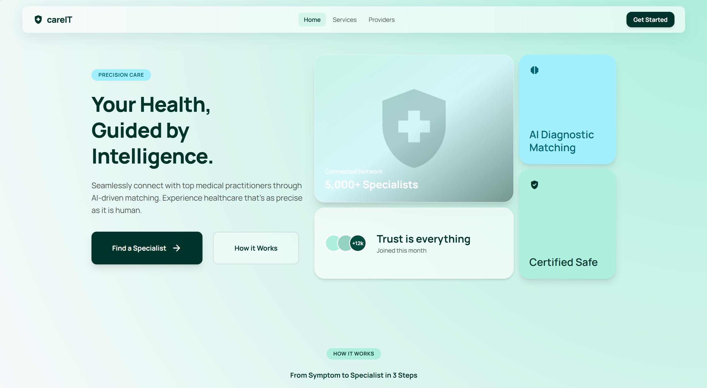

2. Login page
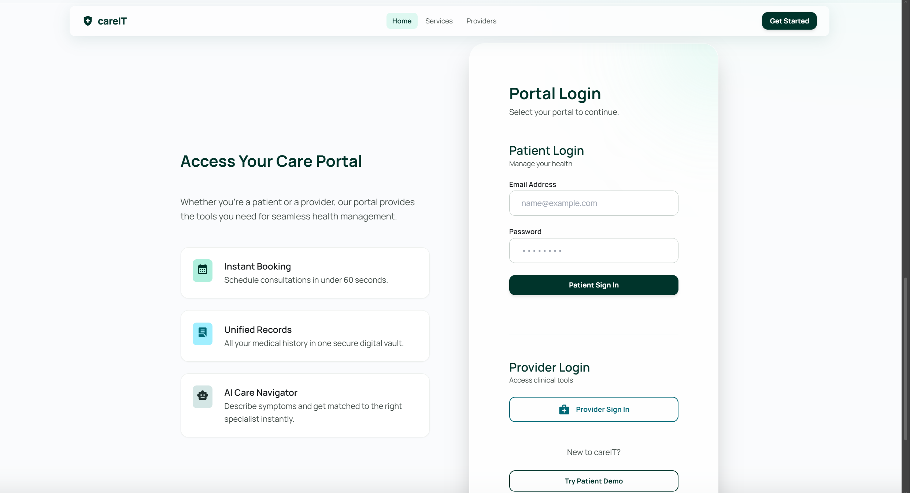

3. Patient searches for a doctor
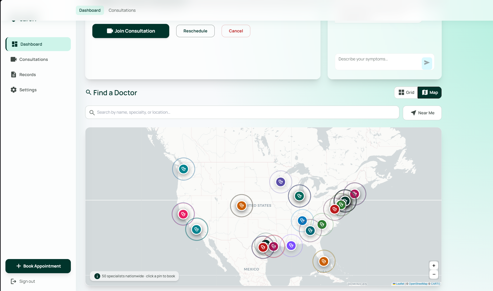

4. AI symptom intake
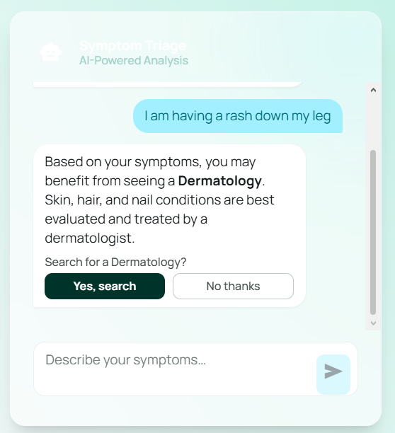

5. Patient chooses a doctor
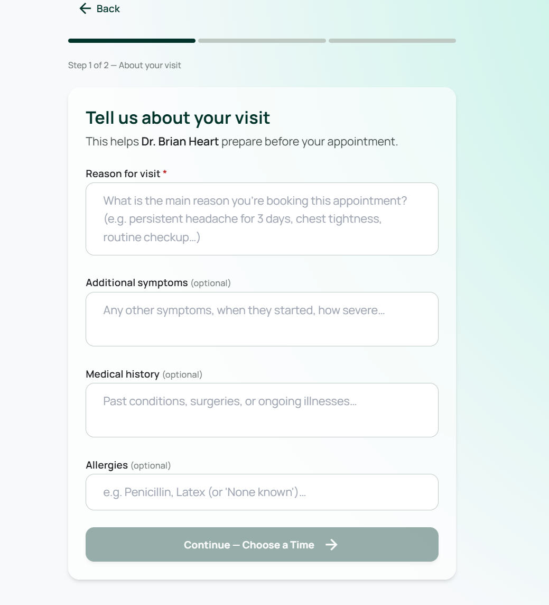

6. Patient books a time slot
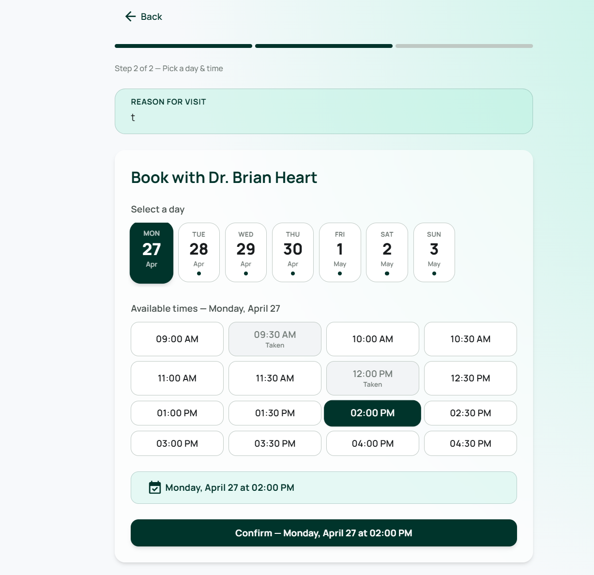

7. Booking success confirmation
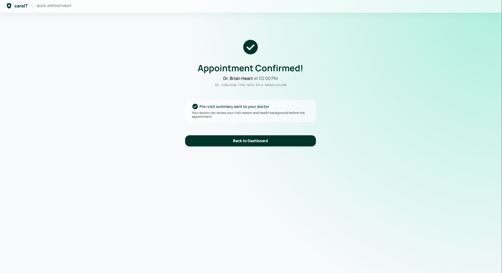

8. Patient joins consultation
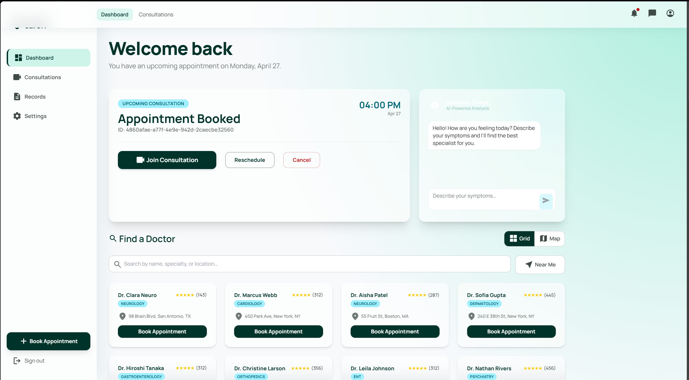

9. Doctor dashboard
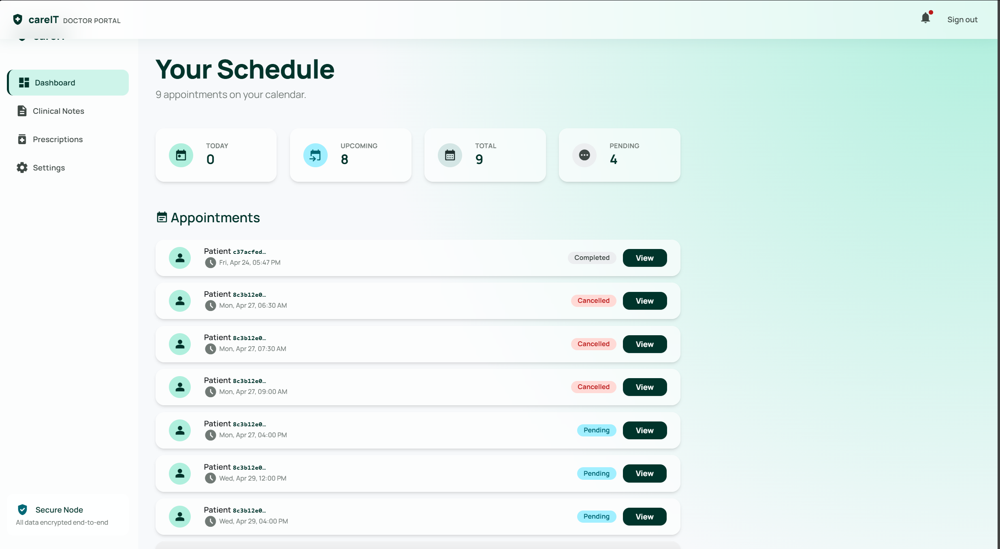

10. Doctor pastes consultation history
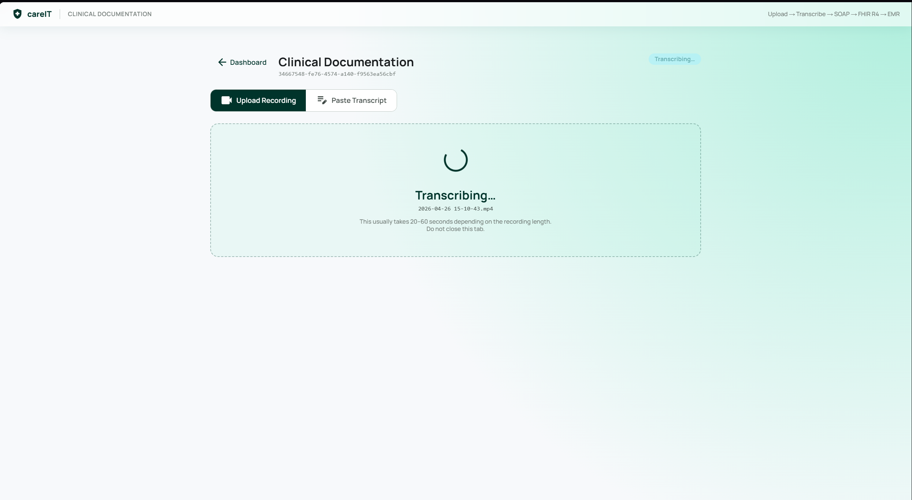

11. SOAP guided notes
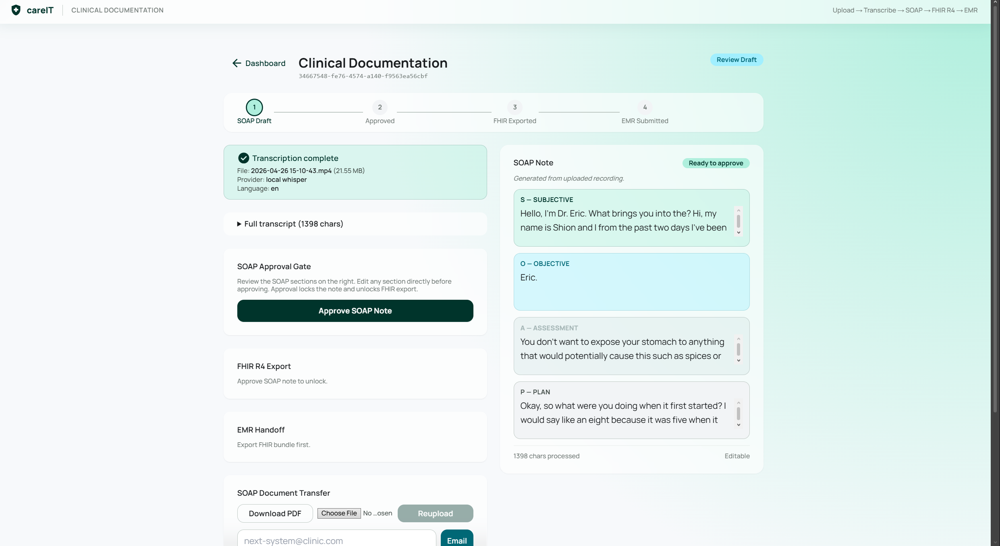

12. Verification and FHIR export
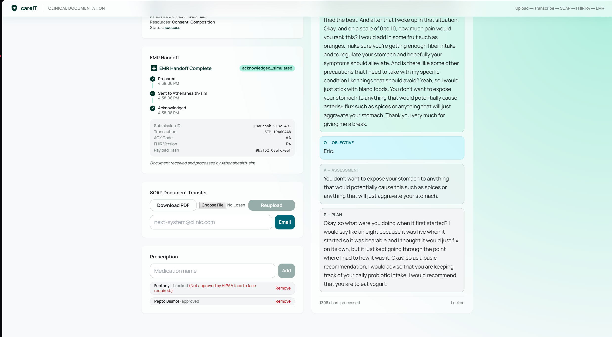